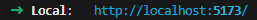
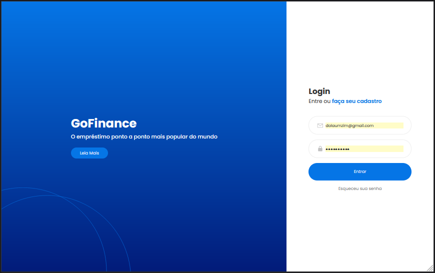
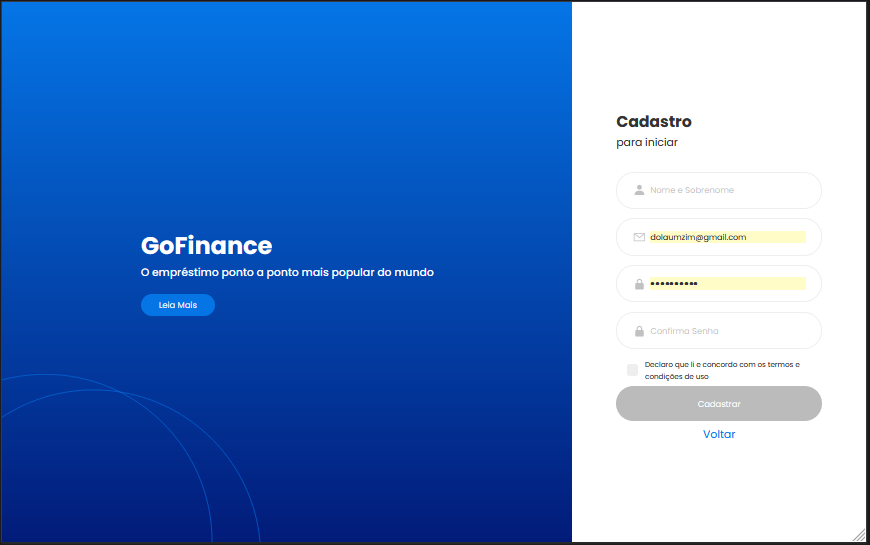

# GoFinance - Armando Assini

O presente projeto consiste no desenvolvimento de telas de login e cadastro para a *GoFinance*.

Todo o processo foi desenvolvido utilizando *ReactJS*.

## Começando

Para rodar o projeto é necessario clonar o repositório para seu computador e fazer as instalações mencionadas a seguir para rodá-lo em browser. Todos os browsers são suportados, porém é possível que ocorram leves diferenças de visualização dependendo do software e da versão do software utilizados.

### Instalação

Para realizar as instalações necessárias, siga o seguinte passo a passo:

Primeiramente clone o repositório para sua máquina, utilize o método de clone que preferir:

    https://git.raroacademy.com.br/armando.assini/atividade-avaliativa-6 
    
Em seguida abra o repositório e utilize o seguinte comando para instalar as dependências do projeto:

    npm install

A partir destas instalações o projeto já estará funcional. Rodando o comando seguinte, um servidor irá abrir onde a aplicação estará rodando:

    npm run dev

No terminal será mostrado um link de onde pode ser visualizada a aplicação:

## Visão Geral do Projeto

Para a montagem do projeto foi fornecido um layout do Figma, que pode ser encontrado através do link

- [Figma GoFinance](https://www.figma.com/file/tYjf8SlPkvF2AXp0LLUWRB/Raro-Academy---Login-%2B-Register?node-id=102%3A71&mode=dev)

Como resultado do projeto temos:

   
   

Ambas as telas tem a mesma estrutura, que será analisada posteriormente, componente a componente.

## Construção do Projeto

### Objetivo

Como mencionado o projeto foi todo realizado utilizando *ReactJS*.

O objetivo principal da prática era permitir os alunos o aprimoramento do uso da ferramenta, assim como a utilização mais aprofundada de formulários, validação de dados, e requisições cia API. Para tal foram utilizadas as bibliotecas:
- *Formik*, para os formulários;
- *Yup*, para as validações;
- *Axios*, para requisições.

### Desenvolvimento

O *figma* apresentado é uma continuação de um trabalho realizado previamente, porém este tinha sido realizado apenas com *Javascript*, portanto foi necessário fazer as devidas mudanças de código, para a tipagem *Typescript* e *ReactJS*.

Em seguida foi iniciada a componentização dos elementos julgados necessários, são eles:

- Button
- ErrorMessage
- HomeScreen
- Input
- LeftContainer
- LoginContainer
- SignInContainer
- UnderConstruction
- UnderConstruction2

A partir dos componentes foram criadas as telas de *Login* e *Cadastro*. Começando pela tela de *Login*:

Nesta tela o usuário já cadastrado coloca seu email e senha para entrar no site. Ao clicar no botão de *'Entrar'* é feita uma requisição com os dados entrados e caso os dados estejam corretos o usuário é redirecionado para uma tela inicial imaginária, além disso os dados cadastrados do cliente logado são guardados no armazenamento local.

Caso ocorra erro de validação uma mensagem de erro aparecerá em tela.

Ainda na tela de *Login* existem 2 links e um outro botão. O link *'faça seu cadastro'* direciona o usuário para a tela de cadastro, enquanto o link *'Esqueceu sua Senha'* e o botão *'Leia Mais'* direcionam para páginas ainda não implementadas.

Já na tela de cadastro:

Nesta tela o usuário não cadastrado pode realizar seu cadastro a partir de 4 campos:

- Nome e Sobrenome;
- Email;
- Senha;
- Confirmação de senha.

Para finalizar o cadastro é necessário preencher devidamente cada um dos campos, pois cada um possui sua própria validação de digitação, além de aceitar os *termos de uso* do site, usando a checkbox. Somente então o botão de cadastro será liberado para finalizar a ação.

Ao clicar no botão *'Cadastrar'* um requisição é realizada e as informações do usuário são guardadas na API, e a partir de então o usuário passar a ter o *login* autorizado.

Ainda na tela de *Cadastro* existe o botão *'Leia Mais'* como mencionado na tela de *Login*, e também há um link *'Voltar'* que leva o usuário para a tela de *Login*.

### Dificuldades Encontradas

Como foram utilizados componentes na atividade anterior, a componentização não foi uma tarefa muito complexa neste caso. Porém como foi solicitada a componentização do mais número possível de elementos, a maior dificuldade foi encontrar os elementos corretos a componentizar, visando o melhor aproveitamento do código.

Também é interessante denotar que o uso de requisições de API foi uma dificuldade encontrada. Como não havia tido experiências como requisições, como tratar os dados que são recebidos, como tratar os erros apresentados, houve a necessidade de um estudo mais minuncioso sobre o assunto.

## Conclusão

Ao final do desenvolvimento o projeto está funcional, aprensentando responsividade para aparelhos móveis.

A proposta da atividade foi seguida e o conteúdo referente ao uso das bibliotecas foi compreendido.

## Possíveis Melhoras

Segue uma lista de sugestões de melhorias futuras:
- Implementar um bloqueio à tela *'Home'* se o usuário não está logado;
- Implementar um botão de *logout*.
- Implementar um *Loading* para os momentos de requisição caso a API demore a responder;
- Implementar novas informações na área *'Home'*;

## Autor

  - **Armando Assini** - *arm.assini@gmail.com*

**Contribuições** - Professores, Monitores e Colegas de classe Turma React2 - Raro Academy.
